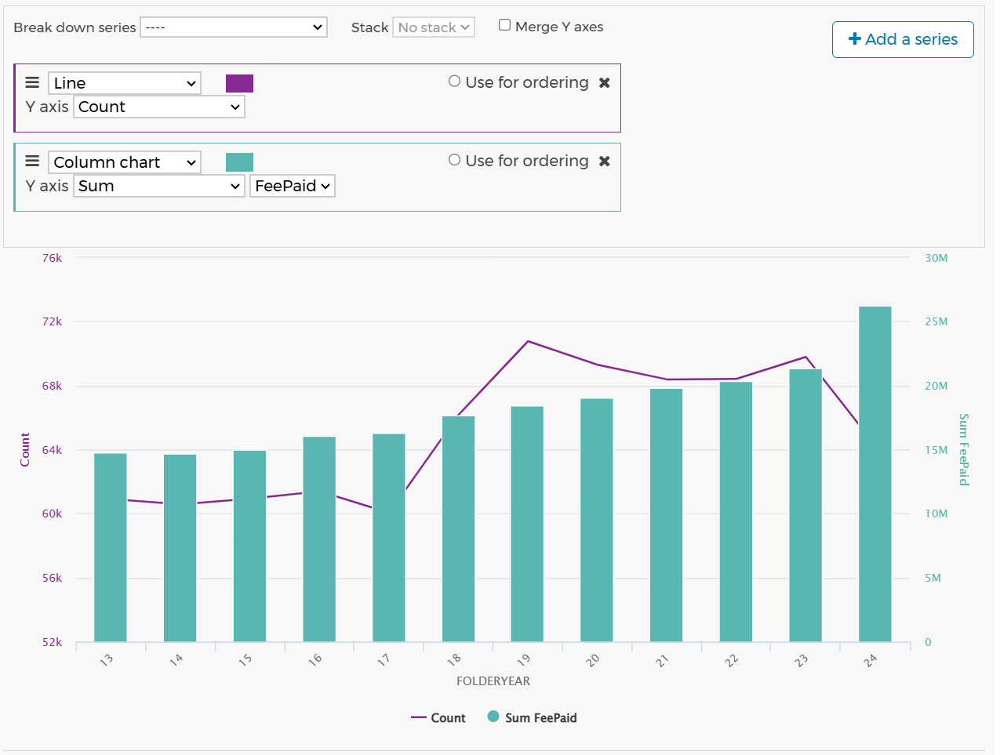
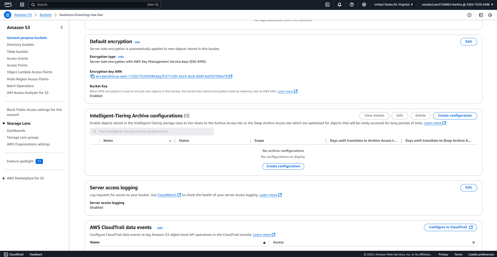
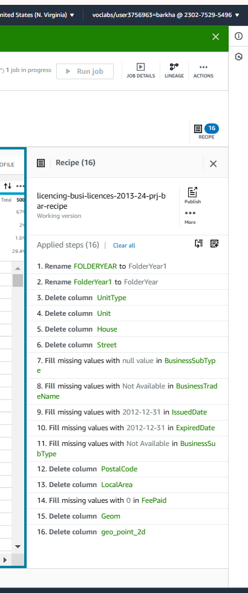
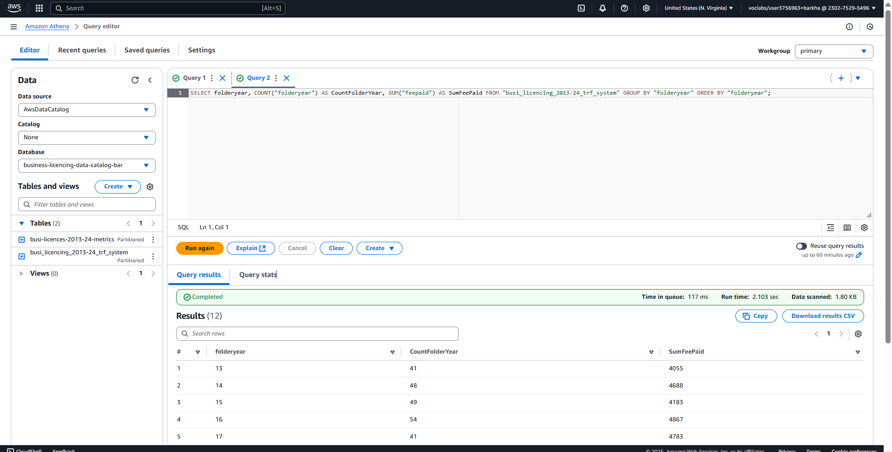
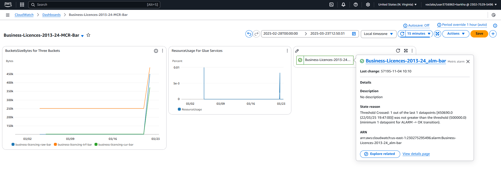
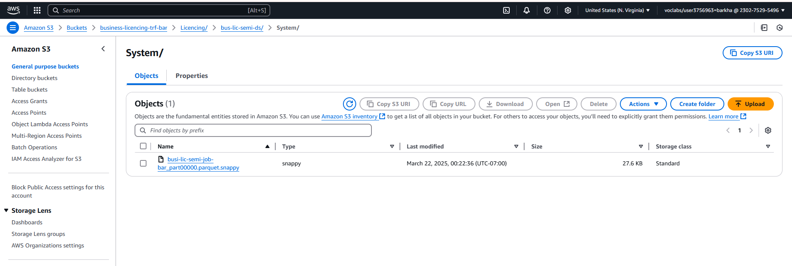
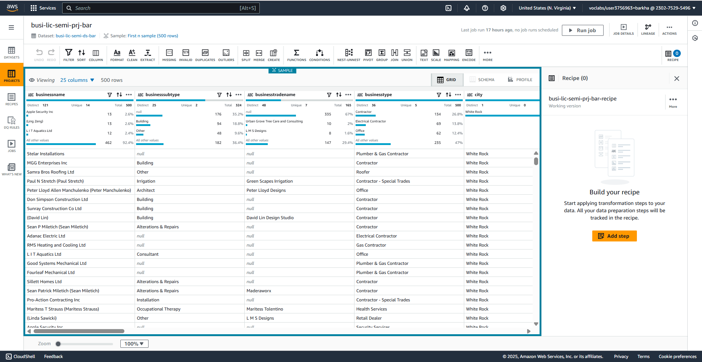
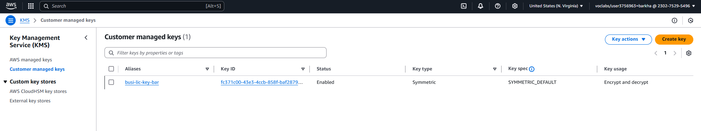
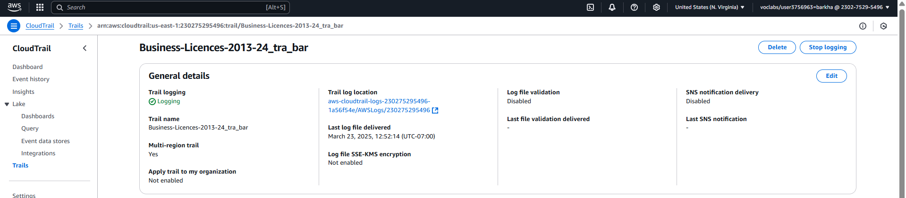
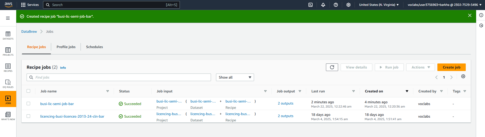

# Cloud Computing & Business Insights: CloudCatalyst Portfolio

_Cloud Computing Foundation_ certification badge earned by **Barkha Kukreja**, demonstrating fundamental cloud expertise. This portfolio project leverages those cloud skills to deliver business insights from real-world data. The project showcases an AWS-powered data analytics pipeline developed to derive insights from the City of Vancouver’s business licence dataset.

---

  
<strong>Objective</strong>

  
This project aimed to develop an end-to-end **Data Analytic Platform (DAP)** on AWS to analyze **City of Vancouver business license data (2013–2024)** and uncover meaningful business insights. This involved designing a robust cloud-based data pipeline to ingest and process a large public dataset, ensure data quality and security, and enable interactive analysis. By accomplishing this, the project demonstrates how cloud services can transform open data into valuable insights into urban business activity, supporting data-driven decision-making for stakeholders (e.g., city officials, entrepreneurs, or potential investors).

  
<strong>Dataset</strong>

**City of Vancouver Business Licences (2013–2024)**, a public open dataset containing detailed records of business licences issued in the City of Vancouver from 2013 up to May 5, 2024 [City of Vancouver Open Data Portal](https://opendata.vancouver.ca/explore/dataset/business-licences-2013-to-2024/) 

### **Key Attributes:**

- **Licence Details:** Licence number, status (e.g. issued, expired, or gone out of business), issue date and expiry date (business licences are typically annual).
- **Business Information:** Business name and trade name, business type category (original classification), number of employees, and fee paid for the licence.
- **Location Information:** Business address and geographic coordinates (if the business is within city limits).

In total, the dataset contains over 780,000 records, reflecting the city’s active business landscape over 11+ years. (Under Licence By-law No. 4450, every business in Vancouver must obtain a valid licence to operate).

> **Note:** In May 2024, the City streamlined its business licence categories, consolidating 500+ business types into fewer than 100​ [City of Vancouver Open Data Portal](https://opendata.vancouver.ca/explore/dataset/business-licences-2013-to-2024/). This project’s analysis uses the original categories for consistency across 2013–2024 data. (Records from 2013–early 2024 use the pre-consolidation categories, as provided in the open dataset.) Data quality considerations from the source were also noted. For example, addresses for home-based businesses are partially redacted for privacy​ [City of Vancouver Open Data Portal](https://opendata.vancouver.ca/explore/dataset/business-licences-2013-to-2024/), and a unique ID (Licence RSN) is used to identify each licence to avoid any duplication issues​.

### **Dataset Visualization:**

**Figure 1.**
  A graph for business licensing activity patterns and yearly contributions from business authorization fees in White Rock city from 2013-2024."
 

_Note:_ Displays annual issued licence counts and total fees, highlighting economic fluctuations and growth trends over the study period.

  
<strong>Methodology</strong>

To achieve the project objectives, a full AWS-based data pipeline was implemented with the following steps:

**Data Ingestion:**  
The raw data (downloaded as CSV from Vancouver’s Open Data Portal) was **ingested into Amazon S3**, establishing a data lake for raw and processed data. An **AWS KMS** (Key Management Service) key was used to encrypt the data at rest in S3 for security. Versioning was enabled on the S3 bucket to track any changes to the dataset over time.

  

_Note_: Demonstrates secure storage of raw dataset using AWS KMS-managed keys.

---

**Data Preparation & Cleaning:**  
Using **AWS Glue DataBrew**, the dataset was profiled and cleaned through a no-code/low-code interface. This involved handling missing or anonymized fields (for instance, some home-based businesses lack address details by design  [City of Vancouver Open Data Portal](https://opendata.vancouver.ca/explore/dataset/business-licences-2013-to-2024/)), standardizing date and string formats, and filtering out irrelevant or duplicate records. A **DataBrew** _recipe_ was created to document all transformation steps (e.g., trimming whitespace in business names and converting the two-digit `FOLDERYEAR` field into a full year). This recipe was then applied in a DataBrew job, which output a **cleansed, enriched dataset** back to S3 in parquet format.

  

_Note:_ Highlights visual transformation steps applied to prepare clean, queryable data.

---

**Data Cataloging:**  
An **AWS Glue Data Catalog** database and table were set up to catalog the cleaned data. The schema (column names and data types for each attribute, such as BusinessType, IssueDate, FeePaid, etc.) was defined so that other services could easily query the data. This was done by running an AWS Glue Crawler on the cleaned data in S3, which automatically inferred the schema and registered it in the Glue Catalog. The cataloged table was partitioned by year to improve query performance (each `FOLDERYEAR` as a partition).

---

**Data Analysis (Interactive Queries):**  
**Amazon Athena** analyzed the data directly from S3 via SQL queries. With the data catalog in place, Athena could query the business licence table using standard SQL without provisioning any servers. Multiple analyses were conducted:

- *Time-series analysis:* Counting the number of new licences issued each year and summing total fees collected per year.  
- *Category analysis:* Identifying the most common business categories (e.g., determining which business types had the highest number of licences) and how this distribution changed over time.
- *Status analysis:* Examining licence status trends (how many licences were not renewed or marked “Gone Out of Business” each year, etc.).  
- *Geographic analysis:* Using coordinates and address data to summarize licences by neighbourhood (e.g., Downtown vs. other areas) to see which areas had the most business activity or the highest closure rates. These queries were saved and could be re-run or adapted for further exploration. Athena’s results for key queries were exported to CSV/JSON for reporting.

  

_Note_ Illustrates the SQL used to derive key annual business metrics using Amazon Athena.

---

**Monitoring & Logging:**  
Throughout the process, **AWS CloudWatch** and **AWS CloudTrail** were enabled to monitor the platform’s operations. CloudWatch Logs captured the DataBrew job execution details (and any error logs) and Athena query logs, including performance metrics like execution time and data scanned. CloudWatch metrics were used to verify that the DataBrew jobs and Athena queries stayed within expected run times and cost boundaries. **AWS CloudTrail** was used to audit actions in the AWS account – for example, logging who ran Athena queries or when the S3 data was accessed – providing an extra layer of transparency and security compliance for the data pipeline.

  

_Note:_ Displays usage metrics and query performance logs for data pipeline visibility.

  
<strong>Tools & Technologies</strong>

**Amazon S3:**  
Scalable object storage used as the data lake for this project. Raw CSV data and transformed parquet data reside in S3, benefiting from high durability and integration with other AWS services.

  

_Note:_ Demonstrates how business licence data is efficiently stored in parquet format within the S3 data lake for high-performance querying.

---

**AWS Glue DataBrew:**  
A visual data preparation tool that was used to clean and transform the licence data without writing code. DataBrew’s interactive interface and transformations (splitting columns, merging data, filtering, etc.) accelerated the data cleaning process.

  

_Note:_ Highlights the no-code interactive data transformation workspace used in the analysis pipeline.

---

**AWS Glue Data Catalog:**  
A centralized metadata repository to store the schema of the dataset. By cataloging the data, it became queryable by Athena using a familiar database/table paradigm.

---

**Amazon Athena:**  
A serverless interactive query service that allows execution of SQL queries on data in S3. Athena was crucial for analyzing the data (e.g., aggregating records by year or business type) on demand, with results returned in seconds and without managing any infrastructure.

  

<em>Figure No. 30 (Part 2 – Athena SQL Query for Aggregating Licence Data by Year)</em>  
_Note:_ SQL-based querying directly over S3-integrated datasets enabled rapid analysis without provisioning compute.

---

**AWS KMS (Key Management Service):**  
Managed encryption keys used to encrypt data in S3 and protect sensitive information. KMS ensured that the data (especially any containing business personal details) was secured to meet compliance requirements.

  

_Note:_ Displays symmetric encryption key creation for securing sensitive datasets.

---

**Amazon CloudWatch:**  
Monitoring service used to collect and track metrics and logs from DataBrew and Athena. CloudWatch was configured to trigger alerts for any failed data processing jobs and to visualize trends in query run times.

  

_Note:_ Dashboards monitored resource usage, job success, and failures in near real-time.

---

**AWS CloudTrail:**  
Governance and auditing service enabled to log all actions taken on AWS resources. CloudTrail logs provided an audit trail (e.g., who accessed the S3 data or ran specific Glue/Athena operations), which is important for security and accountability in an enterprise setting.

  

_Note:_ Activity logs recorded all user actions across AWS services for accountability and audit compliance.

---

**Amazon IAM:**  
(Underlying all components) Identity and Access Management was used to define fine-grained access policies. For example, IAM roles were created to allow Glue and Athena services to read the S3 data, and user permissions were set so that only authorized persons could query or modify the dataset.

  
<strong>Deliverables</strong>

This project resulted in several tangible deliverables:

**Cleaned Data Lake (S3 Buckets):**  
A structured data lake containing the processed business licence data in parquet format, partitioned by year. Both the raw and clean datasets are available, with the latter ready for efficient querying.

  

_Note:_ Displays optimally formatted, analytics-ready business licence data stored in Amazon S3.

---

**DataBrew Transformation Recipe:**  
An AWS Glue DataBrew recipe (and job) encapsulates all data-cleaning steps. This recipe serves as documentation of data preparation logic and can be re-run on updated data or reused for similar datasets.

  

_Note:_ A successful job ensures a validated transformation process and ready-to-query dataset.

---

**Athena Query Set:**  
A collection of saved SQL queries in Amazon Athena is used to generate key insights (e.g., yearly license counts, top 10 business types by count, licenses by neighbourhood, etc.). These queries, along with their results, are provided as part of the analysis documentation.

  

_Note:_ Illustrates interactive querying used to summarize and analyze annual licensing metrics.

---

**Analytical Visualizations:**  
Graphical outputs highlighting important findings. For example, the Figure below illustrates the trend of business licence issuances and fee revenues over time. Additional charts (not shown here) were prepared to visualize the breakdown of licences by business type and by geographic area, enabling intuitive communication of the data insights.

  

_Note:_ Displays annual issued licence counts and total fees, highlighting economic fluctuations and growth trends.

---

**Documentation & Presentation:**  
A comprehensive report (in the form of this README and an accompanying slide deck) describing the project approach, cloud architecture diagrams of the solution, and a discussion of insights gained. This documentation is intended for academic review and for showcasing the project to potential employers or clients, demonstrating both technical implementation and business analysis outcomes.

  
<strong>Insights & Findings</strong>

Below Figure - Business Licensing Activity Patterns. The chart above illustrates Vancouver’s business licensing activity over 2013–2024, showing **annual licences issued (purple line) and total licence fees collected (teal columns)**. There was steady growth in the number of business licences issued each year from 2013 through 2019, reflecting a robust local economy and increasing entrepreneurial activity. The peak occurred in 2019, where over **80,000** licences were issued, corresponding to roughly **$12 million** in total fees collected by the city. In 2020, a noticeable dip in new licences (and revenue) is observed – a likely impact of the COVID-19 pandemic and economic slowdown during that year. However, the trend rebounded in 2021 and onward, with 2022–2023 nearly returning to or exceeding pre-pandemic levels. (_2024 data in the chart covers only Jan–May 2024, hence appears lower_.) This temporal analysis highlights how external events can significantly influence business activity in the city.

  

_Note:_ Displays annual issued licence counts and total fees, highlighting economic fluctuations and growth trends.

- **Dominant Business Categories**: The analysis revealed that certain business types consistently led in number of licences. In particular, the _“Office”_ category (representing general office-based businesses) had the highest count of licences each year, making it the most common business type in Vancouver’s economy. Other top categories included **Retail Trade** (various stores and dealers) and **Food Services** (restaurants, cafes, etc.), which account for many active businesses. This dominance of offices and retail/food services indicates Vancouver’s role as a commercial and service-oriented hub. Meanwhile, some niche categories had relatively few licences. The diversity of over 500 business categories (pre-2024) also suggested a very heterogeneous business environment, ranging from tech startups to home-based artisans.

- **Geographical Distribution**: Business licence data by location underscored the _Downtown core (Central Business District) as the primary locus of business activity. The downtown area consistently saw the **highest concentration of active licences**, which is unsurprising given it’s the city’s commercial center. Other commercial corridors (e.g., Broadway, Metrotown vicinity just outside Vancouver) also showed high business counts. In contrast, residential neighbourhoods on the city’s outskirts had fewer active businesses and new licences. Interestingly, the data also pointed to higher rates of business churn in certain areas – for instance, the Renfrew/Collingwood neighbourhood had a notable number of licences with “Gone Out of Business” status relative to its total licences. This could suggest local economic challenges or shifting business demographics in that area, warranting further investigation by city planners or business development agencies.

- **Business Survival & Turnover**: By tracking licence statuses year over year, the project derived insights into business survival rates. A significant majority of licences each year were renewals of existing businesses (or continuations), indicating many businesses survive year-to-year. However, every year, a fraction of businesses do not renew – some formally close (marked as _business closed/gone out of business in the data_) while others possibly let licences lapse. For example, around **5–8%** of licences in a given year were not renewed the next year, hinting at the annual turnover in the business community. Certain business types, like seasonal markets or short-term ventures, showed higher turnover, whereas essential services (e.g., offices, healthcare, utilities) showed higher renewal rates. This insight into business longevity can be valuable for understanding the stability and dynamism of the local economy.

- **Economic Impact**: The financial aspect of the data – licence fees – highlights that **business licensing is not only a regulatory measure but also a revenue stream for the city**. Over the 2013–2023, the City of Vancouver collected well over **$80 million** in cumulative licence fees from businesses. The upward trend in fees collected (peaking in 2019, as shown in Figure) aligns with the growth in the number of licences but also reflects periodic fee adjustments and the entry of higher-fee business categories. These revenues potentially support city services and small business programs. The dip in 2020 fee revenue was significant, reinforcing how economic downturns directly affect municipal revenue. Post-2020, increasing revenues indicate recovery. This financial insight underscores the importance of supporting business continuity – keeping businesses open not only benefits employment and the economy but also the city’s fiscal health.

### Connect With Me

Feel free to connect for more information or opportunities to collaborate:

- **LinkedIn**: [Barkha Kukreja](https://www.linkedin.com/in/barkhakukreja/)
- **Email**: [Click to Email](mailto:barkhakkukreja@gmail.com)
